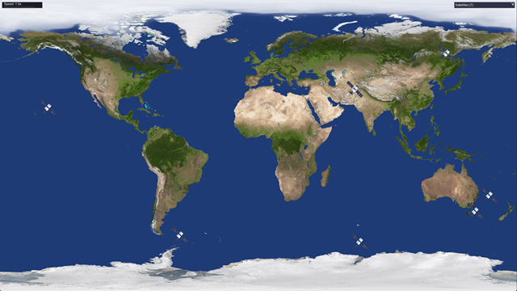

<a id="readme-top"></a>

<br />
<div align="center">
  <a href="https://github.com/your_username/SatelliteTracker">
    
  </a>

<h3 align="center">🛰️ Satellite Tracker</h3>

  <p align="center">
    A C++ application for tracking satellites in real time using TLE data.  
    Built with SDL2 for rendering, SGP4 for orbital propagation, and includes a suite of unit tests.
    <br />
  </p>
</div>

---

## 🗂️ Table of Contents
<details>
  <summary>Click to expand</summary>
  <ol>
    <li><a href="#about-the-project">About The Project</a></li>
    <li><a href="#built-with">Built With</a></li>
    <li><a href="#getting-started">Getting Started</a></li>
    <li><a href="#usage">Usage</a></li>
    <li><a href="#contact">Contact</a></li>
  </ol>
</details>

---

## 🛰️ About The Project

Satellite Tracker is a C++ application for visualizing and tracking satellites using real-world TLE (Two-Line Element) data.  
It provides:

- 🌍 Real-time simulation of satellite positions using **SGP4** propagation  
- 🗺️ 2D map rendering of Earth and satellites with **SDL2**  
- 🔄 Ability to toggle satellite visibility and control simulation speed  
- 🧩 Modular design with unit tests for **SatelliteManager**, **GPSPosition**, **EarthMap**, **SGP4Converter**, **TLEParser**, and **UpdateManager**

<p align="right">(<a href="#readme-top">back to top</a>)</p>

---

## 🧱 Built With

| Tool | Description |
|------|--------------|
|  [![C++20][C++20]][C++20-url] | Core programming language for the project |
|  [![SDL2][SDL2]][SDL2-url] | Rendering and input handling |
|  [![SGP4][SGP4]][SGP4-url] | Satellite orbit propagation |
|  [![GoogleTest][GOOGLETEST]][GOOGLETEST-url] | Framework for unit testing |

<p align="center">
  🚀 <i>Reliable • Modular • Cross-Platform</i> 🌐
</p>

<p align="right">(<a href="#readme-top">back to top</a>)</p>

---

## ⚙️ Getting Started

Follow these steps to build and run the project locally.

### 🧩 Prerequisites

- 💻 **C++20 compiler** (GCC/Clang/MSVC)
- 🛠️ **CMake ≥ 3.20**
- 🎮 **SDL2** and related libraries installed
- 📦 **vcpkg** (optional for dependency management)

### 🏗️ Installation

1. **Clone the repository**
   ```sh
   git clone https://github.com/your_username/SatelliteTracker.git
   cd SatelliteTracker
   
2. Create a build directory and run CMake:
   ```sh
   mkdir build && cd build
   cmake .. -DCMAKE_TOOLCHAIN_FILE=C:/path/to/vcpkg/scripts/buildsystems/vcpkg.cmake
   cmake --build
   
3. Run the executable:
   ```sh
   ./SatelliteTracker

4. Run unit tests:
   ```sh
   ./tests/SatelliteTests

<p align="right">(<a href="#readme-top">back to top</a>)</p>
🎮 Usage

📡 Load TLE files of satellites

👁️ Toggle satellite visibility

⏩ Adjust simulation speed and mode (Manual / Real-time / Simulation)

🌍 Visualize satellite positions on the Earth map in real time

<p align="right">(<a href="#readme-top">back to top</a>)</p>

## Contact

Szekely Botond - [![LinkedIn][LinkedIn]][linkedin-url] - <szekelyboti1@gmail.com>

Project Link: [![GitHub][GitHub]][GitHub-url]

<p align="right">(<a href="#readme-top">back to top</a>)</p>


<!-- MARKDOWN LINKS & IMAGES -->
<!-- https://www.markdownguide.org/basic-syntax/#reference-style-links -->
[GitHub]: https://img.shields.io/badge/GitHub-20232A?style=for-the-badge&logo=github&logoColor=61DAFB
[GitHub-url]: https://github.com/SzekelyBoti/TerraDocker-Store
[LinkedIn]: https://img.shields.io/badge/LinkedIn-20232A?style=for-the-badge&logo=linkedin&logoColor=61DAFB
[linkedin-url]: https://linkedin.com/in/boti-szekely
[C++20]: [https://isocpp.org/](https://img.shields.io/badge/C++-20232A?style=for-the-badge&logo=github&logoColor=61DAFB)
[C++20-url]: https://isocpp.org/
[SDL2]: [https://isocpp.org/](https://img.shields.io/badge/SDL2-20232A?style=for-the-badge&logo=github&logoColor=61DAFB)
[SDL2-url]: https://www.libsdl.org/
[SGP4]: [https://isocpp.org/](https://img.shields.io/badge/SGP4-20232A?style=for-the-badge&logo=github&logoColor=61DAFB)
[SGP4-url]: https://www.celestrak.com/
[GOOGLETEST]: [https://isocpp.org/](https://img.shields.io/badge/GoogleTest-20232A?style=for-the-badge&logo=github&logoColor=61DAFB)
[GOOGLETEST-url]: https://github.com/google/googletest
